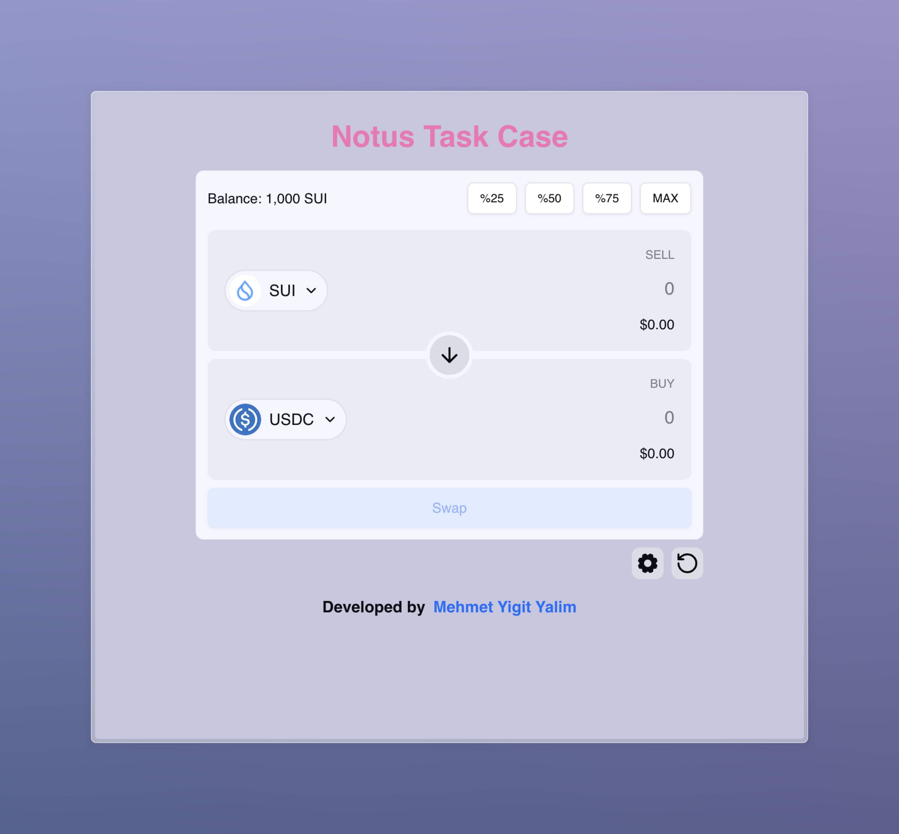
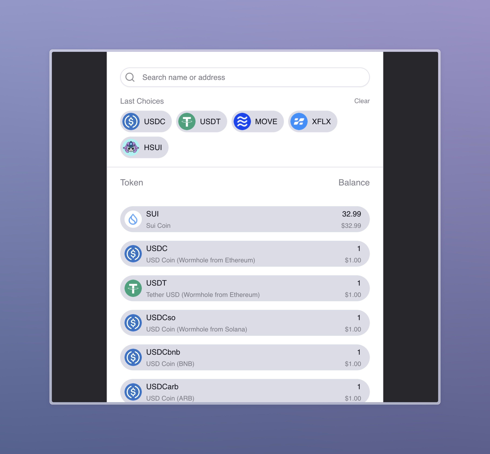
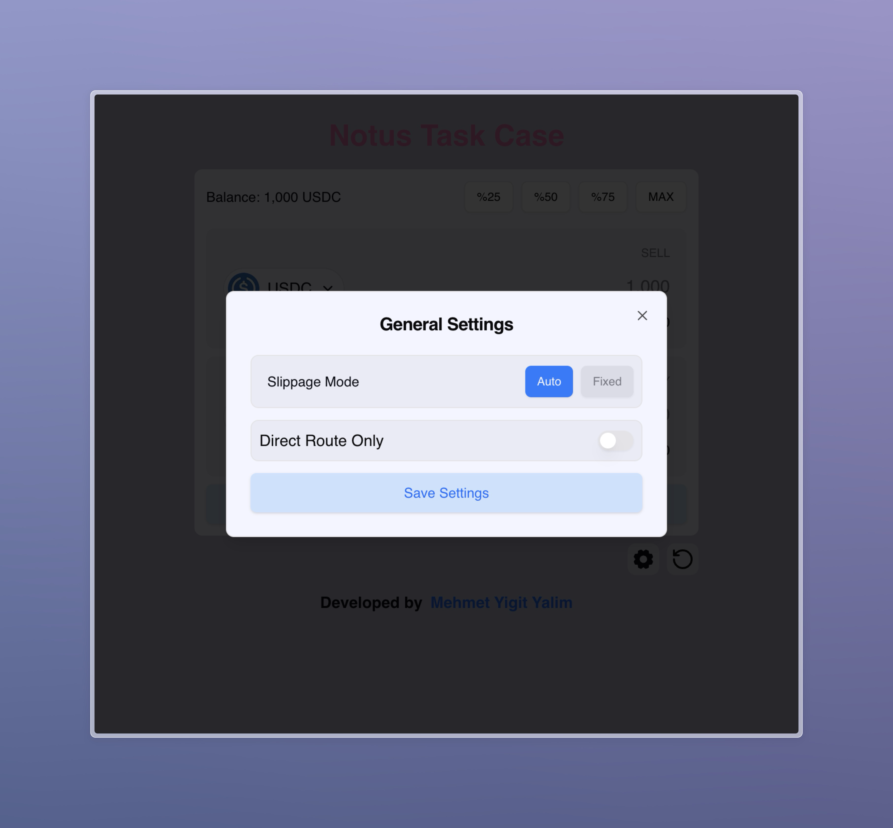
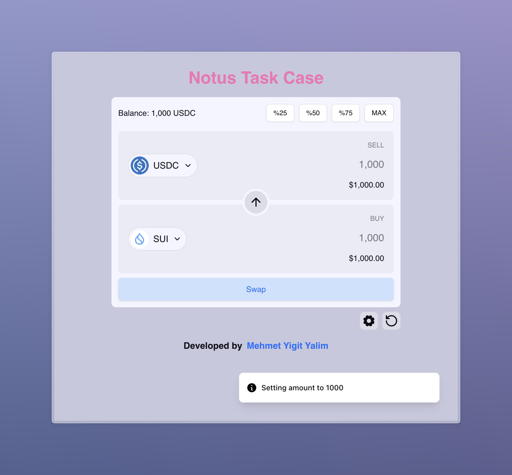

# Notus Case

Bu case Notus firması tarafından istenmiştir.

## İçerik

- [Notus Case](#notus-case)
  - [İçerik](#i̇çerik)
  - [Gereksinimler](#gereksinimler)
  - [Kurulum](#kurulum)
  - [Kullanım](#kullanım)
  - [Ekran Görüntüleri](#ekran-görüntüleri)
  - [Lisans](#lisans)

## Gereksinimler

- [Git](https://git-scm.com/)
- [Node.js](https://nodejs.org/)
- [Pnpm](https://pnpm.io/)

## Kurulum

- Projeyi klonlayın

  ```bash
  # Projeyi klonlayın
  git clone https://github.com/yigityalim/notus-case.git
  ```

- Paketleri yükleyin

  ```bash
    # Proje dizinine gidin
    cd notus-case

    # Paketleri yükleyin
    pnpm install
  ```

- Projeyi çalıştırın

  ```bash
    # Geliştirme modunda çalıştırın
    pnpm dev

    # Üretim modunda çalıştırın
    pnpm build
  ```

## Kullanım

- Projeyi çalıştırdıktan sonra tarayıcınızda `http://localhost:5173` adresine gidin.
- TODO: add use case

## Ekran Görüntüleri

- Ana Sayfa



- Token seçim sayfası



- Ayarlar



- Kullanıcı herhangi bir değişiklik yaptığında çıkan toast:



## Lisans

Bu proje MIT lisansı ile lisanslanmıştır. Daha fazla bilgi için **[LICENCE.md](./LICENCE.md)** dosyasına bakabilirsiniz.
